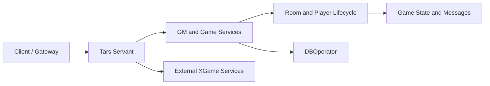
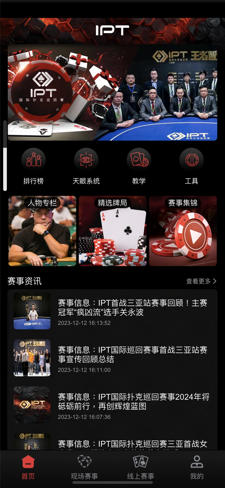
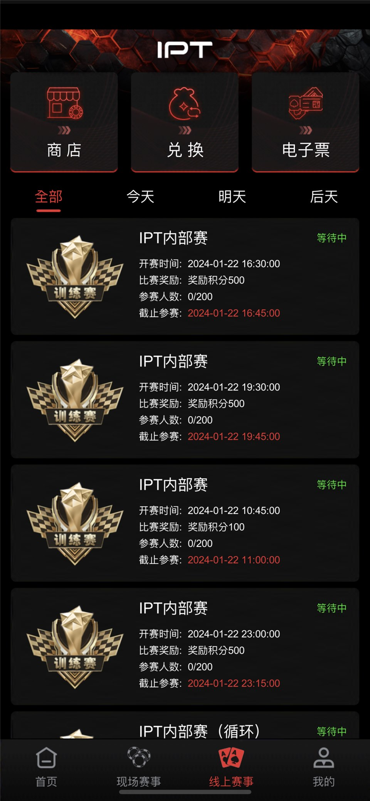

# Texas Hold'em Tournament Platform Source Code: C++ / Tars Room and Event Services

[简体中文](README.md) | **English** | [繁體中文](README.zh-TW.md)

[](GMServer.cpp)
[](GMServant.tars)
[](https://masterai-top.github.io/Texas-Holdem-Poker-Tournament-Event-Platform/)
[](PUBLIC-SCOPE.md)

This repository contains server-side code related to a Texas Hold'em tournament and event platform. The public source primarily includes C++/Tars services, game-room and player-lifecycle components, service interfaces, compiled Protobuf resources, and sequence diagrams for quick games, SNG, and Private play. Product screenshots show tournament listings, on-site event services, content, and table experiences.

> The public tree is not a verified, one-command production release. It depends on an external XGame/Tars environment and lacks some readable protocol sources, complete dependency locking, database migrations, automated tests, and production configuration. Complete MTT, rankings, tickets, hotels, video, and on-site check-in functionality cannot all be verified from the current public code.

## Public scope

| Area | Visible material | Limitation |
| --- | --- | --- |
| Tars services | `GMServer.*`, `GMServantImp.*`, `gameserver.*`, `gameroot.*` | Requires external runtime and configuration |
| Room and game flow | Entry, exit, offline, and game-start components under `core/` | Needs state-machine, concurrency, and failure testing |
| Data access | `DBOperator.*` | Schema, transactions, rollback, and connections must be verified |
| Service contracts | `GMServant.tars`, `JFGame.tars`, `Java2RoomProto.tars`, and others | Versioning and compatibility policy are not documented |
| Protobuf resources | Multiple `*.proto.bytes` files | Binary resources do not replace readable original `.proto` definitions |
| Gameplay material | Quick-game, SNG, and Private diagrams under `游戏玩法/` | Documentation does not prove a complete implementation |
| Product screenshots | `docs/assets/screenshots/` | Product context is not proof of full reproducibility |

See [PUBLIC-SCOPE.md](PUBLIC-SCOPE.md) for the detailed boundary.

## Repository layout

```text
core/                     Room, player, and game-lifecycle components
游戏玩法/                Quick-game, SNG, and Private sequence material
GMServer.*                Tars service entry point
GMServantImp.*            Management service implementation
gameserver.*              Game service components
gameroot.*                Game-root components
DBOperator.*              Data-access components
*.tars                    Tars interface definitions
*.proto.bytes             Compiled protocol resources
makefile                  C++/Tars build entry point
docs/                     GitHub Pages product and technical site
.github/workflows/        GitHub Pages deployment workflow
```

## Product scenarios

The material illustrates online tournaments and news, on-site registration and hotel services, starting-hand charts, video content, and tournament tables. These are product scenarios; complete client, admin, database, and deployment implementations must be verified from the actual tree and a reproducible build.

## Service outline



## Build and deployment

The current `makefile` targets an existing Linux, Tars, and XGame environment and references paths and generated files outside the repository. Before deployment:

1. Record exact GCC/G++, Tars, Protobuf, MySQL client, and shared-module versions in an isolated environment.
2. Review absolute paths, linked libraries, and generated headers in the `makefile`.
3. Add sanitized configuration examples; never commit secrets, real player data, or production endpoints.
4. Establish a minimal build, then test entry, exit, reconnect, duplicate messages, timeouts, and settlement.
5. Exercise database migration, backup, restore, monitoring, and rollback procedures.

See the [deployment checklist](DEPLOYMENT-CHECKLIST.md) and [project site](https://masterai-top.github.io/Texas-Holdem-Poker-Tournament-Event-Platform/).

## Screenshots



| Online tournaments | On-site services | Tournament table |
| --- | --- | --- |
|  |  |  |

## Fairness and security

Files such as `robotwinrate.*` and `setwincard.*` indicate high-risk outcome-control capabilities. Production use requires a documented purpose, restricted access, tamper-evident audit logs, and independent fairness review. Code unnecessary for lawful testing should be excluded from production builds. It must not be used to manipulate real-player outcomes, conceal odds, or evade regulation.

## Documentation

- [Public scope](PUBLIC-SCOPE.md)
- [Deployment checklist](DEPLOYMENT-CHECKLIST.md)
- [Release checklist](RELEASE-CHECKLIST.md)
- [Responsible use](RESPONSIBLE-USE.md)
- [Security policy](SECURITY.md)
- [Support](SUPPORT.md)
- [Architecture](docs/architecture.html)
- [Features and scope](docs/features.html)

## License notice

The current repository `LICENSE` combines MIT permission language, commercial restrictions, and “All Rights Reserved” wording. Those terms may conflict. Obtain legal review, select one clear model or a well-defined dual-license model, and keep the README, About section, sales material, releases, and source headers consistent. This package does not overwrite the current license.

## Related projects

- [MasterAI profile](https://github.com/masterai-top)
- [Texas Hold'em complete solution](https://github.com/masterai-top/TexasHoldem-Poker-Complete-Solution)
- [Texas Hold'em club and match server](https://github.com/masterai-top/Texas-Hold-em-Points-Lobby)
- [CFR poker AI](https://github.com/masterai-top/cfr-poker-ai-masterai)

## Contact and contribution

- [Contributing guide](CONTRIBUTING.md)
- Telegram: [@xuzongbin001](https://t.me/xuzongbin001)
- Email: [masterai918@gmail.com](mailto:masterai918@gmail.com)
