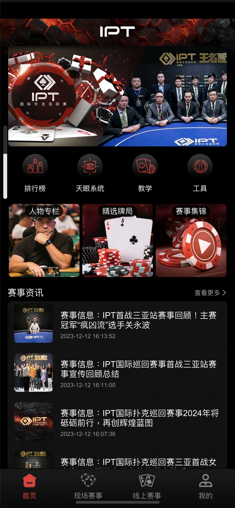
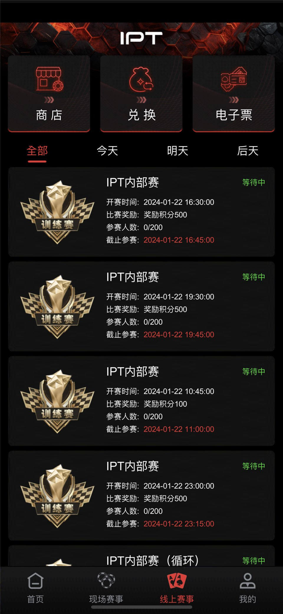
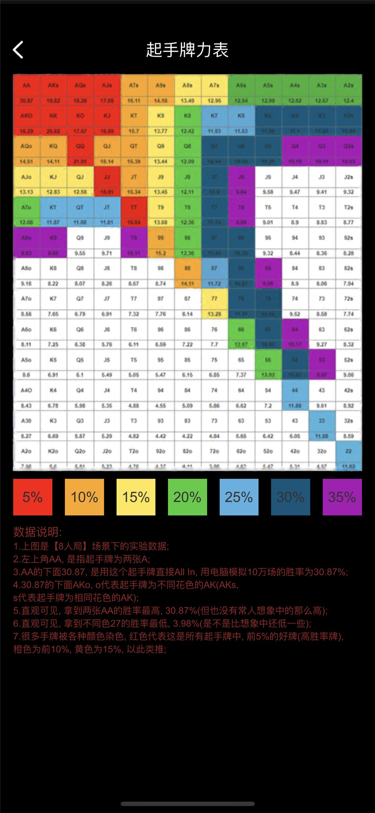
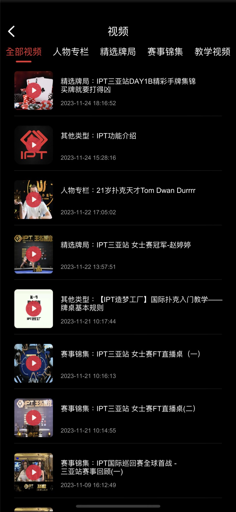

[简体中文](README.md) | [繁體中文](README.zh-TW.md) | [English](README.en.md)

# 德州赛事源码与德州 MTT 源码｜SNG、MTT、线上及线下赛事 C++/Tars 服务端

这是一个面向**德州赛事源码、德州 MTT 源码、SNG 单桌赛及线上/线下赛事场景**的源码仓库。当前公开内容包括 C++/Tars 服务、房间与玩家生命周期组件、数据操作、服务接口、编译后的 Protobuf 资源，以及快速游戏、SNG 和 Private 玩法时序资料。

> 当前仓库不是经过验证的一键部署发行包。它依赖外部 XGame/Tars 环境，并缺少部分可读协议源码、完整依赖锁定、数据库迁移、自动化测试和生产配置。实际能力以公开文件及可复现构建结果为准。

## 搜索词与公开内容

| 搜索主题 | 可核对内容 | 公开边界 |
| --- | --- | --- |
| 德州赛事源码 | C++/Tars 服务、房间流程、赛事截图与技术文档 | 不代表完整客户端和运营后台均已公开 |
| 德州 MTT 源码 | MTT 产品场景、赛事牌桌及服务端基础组件 | 完整 MTT 生命周期仍需按代码和构建结果核对 |
| 德州源码 | 游戏服务、Tars 接口、数据操作和协议资源 | 仓库重点是赛事平台，不是完整通用德州发行包 |
| 线下德州赛事 | 报名、现场服务及配套信息截图 | 支付、票务、现场系统不能仅凭截图确认 |

专题介绍：[德州赛事源码](https://masterai-top.github.io/Texas-Holdem-Poker-Tournament-Event-Platform/zh-cn/texas-holdem-tournament-source-code.html) · [德州 MTT 源码](https://masterai-top.github.io/Texas-Holdem-Poker-Tournament-Event-Platform/zh-cn/mtt-poker-source-code.html)

## 公开内容

| 范围 | 可见文件 | 说明 |
| --- | --- | --- |
| C++/Tars 服务 | `GMServer.*`、`GMServantImp.*`、`gameserver.*`、`gameroot.*` | 需要外部运行环境与配置 |
| 房间与玩家流程 | `core/` 中入桌、离桌、掉线和开局组件 | 上线前需要并发和异常测试 |
| 数据操作 | `DBOperator.*` | 数据库结构、事务和连接配置需要核实 |
| 服务协议 | `GMServant.tars`、`JFGame.tars`、`Java2RoomProto.tars` | 应补充版本兼容策略 |
| 玩法资料 | `游戏玩法/` 中快速游戏、SNG、Private 时序资料 | 文档不代表完整功能已经公开 |
| 产品截图 | `docs/assets/screenshots/` | 展示赛事场景，不等于完整客户端源码 |

## 德州扑克赛事场景

- SNG 单桌赛事与快速开赛流程
- MTT 多桌锦标赛和赛事房间场景
- 线上赛事列表、赛事资讯及内容展示
- 线下赛事报名、现场服务及配套信息
- 牌桌、玩家生命周期和游戏服务接口

## 产品截图

| 赛事首页 | 在线赛事 | 赛事牌桌 |
| --- | --- | --- |
|  |  |  |

| 现场服务 | 起手牌资料 | 赛事视频 |
| --- | --- | --- |
|  |  |  |

## 技术文档

- [服务端架构](docs/server-architecture.md)
- [房间消息流程](docs/room-message-flow.md)
- [构建指南](docs/build-guide.md)
- [部署检查清单](DEPLOYMENT-CHECKLIST.md)
- [安全与合规](docs/security-compliance.md)
- [公开范围](PUBLIC-SCOPE.md)

## 公平性与合规

仓库中存在与机器人胜率或牌局结果控制有关的高风险组件。正式环境必须限制访问、记录不可篡改审计并接受独立公平性评估；不得用于操纵真实玩家结果、隐瞒概率或规避监管。

## 联系

- Telegram：[@xuzongbin001](https://t.me/xuzongbin001)
- Email：[masterai918@gmail.com](mailto:masterai918@gmail.com)

请遵守所在地法律法规和平台规则。本仓库不鼓励或支持任何非法赌博或现金交易。
