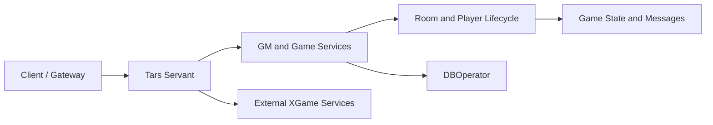

# 德州撲克賽事平台原始碼：C++ / Tars 房間與賽事服務

[简体中文](README.md) | [English](README.en.md) | **繁體中文**

[](GMServer.cpp)
[](GMServant.tars)
[](https://masterai-top.github.io/Texas-Holdem-Poker-Tournament-Event-Platform/)
[](PUBLIC-SCOPE.md)

這是一個與德州撲克賽事及活動平台相關的伺服器端程式碼倉庫。目前公開程式碼主要包括 C++/Tars 服務、遊戲房間與玩家生命週期元件、服務介面、已編譯的 Protobuf 資源，以及快速遊戲、SNG 和 Private 玩法時序資料。倉庫截圖展示賽事列表、現場賽事服務、內容與牌桌等產品場景。

> 目前公開目錄不是已驗證的一鍵上線發行包：它依賴外部 XGame/Tars 環境，缺少部分可讀協議原始檔、完整依賴鎖定、資料庫遷移、自動化測試和正式環境設定。完整 MTT、排名、門票、酒店、影片或現場報到等能力，無法只憑目前公開程式碼全部驗證。

## 目前公開範圍

| 範圍 | 可見內容 | 說明 |
| --- | --- | --- |
| Tars 服務 | `GMServer.*`、`GMServantImp.*`、`gameserver.*`、`gameroot.*` | 需要外部執行環境與設定 |
| 房間與牌局 | `core/` 中入桌、離桌、離線、開局等元件 | 上線前需要狀態機、並行與異常測試 |
| 資料操作 | `DBOperator.*` | 需要核對資料庫結構、交易、回復與連線設定 |
| 服務協議 | `GMServant.tars`、`JFGame.tars`、`Java2RoomProto.tars` 等 | 應補充版本與相容策略 |
| Protobuf 資源 | 多個 `*.proto.bytes` | 二進位資源不能替代可讀的原始 `.proto` 定義 |
| 玩法資料 | `游戏玩法/` 中快速遊戲、SNG、Private 時序圖 | 文件不代表對應功能已完整公開或驗證 |
| 產品截圖 | `docs/assets/screenshots/` | 展示產品場景，不等同於程式碼可完整重現 |

更詳細的邊界請見 [PUBLIC-SCOPE.md](PUBLIC-SCOPE.md)。

## 程式碼結構

```text
core/                     房間、玩家和牌局生命週期元件
游戏玩法/                快速遊戲、SNG、Private 等時序資料
GMServer.*                Tars 服務入口
GMServantImp.*            管理服務實作
gameserver.*              遊戲服務元件
gameroot.*                遊戲根物件相關元件
DBOperator.*              資料操作元件
*.tars                    Tars 介面定義
*.proto.bytes             已編譯的協議資源
makefile                  C++/Tars 建置入口
docs/                     GitHub Pages 產品與技術網站
.github/workflows/        GitHub Pages 發布工作流程
```

## 產品場景

產品資料展示線上賽事、賽事資訊、現場報名和酒店服務、起手牌力表、影片內容與賽事牌桌等方向。以上屬於產品場景；完整客戶端、後台、資料庫與部署實作必須以實際目錄和可重現建置為準。

## 服務結構



## 建置與部署

目前 `makefile` 面向既有 Linux、Tars 和 XGame 環境，並引用倉庫外部路徑與產生檔案。建議先：

1. 在隔離環境記錄 GCC/G++、Tars、Protobuf、MySQL 用戶端和共用模組版本。
2. 檢查 `makefile` 中的絕對路徑、連結函式庫和產生的標頭檔。
3. 建立脫敏設定範例，不提交密鑰、真實玩家資料或正式環境位址。
4. 完成最小建置，再驗證入桌、離桌、斷線重連、重複訊息、逾時和結算。
5. 對資料庫遷移、備份、還原、監控和回復進行演練。

詳見 [部署檢查清單](DEPLOYMENT-CHECKLIST.md) 和 [專案網站](https://masterai-top.github.io/Texas-Holdem-Poker-Tournament-Event-Platform/)。

## 產品截圖


| 線上賽事 | 現場賽事服務 | 賽事牌桌 |
| --- | --- | --- |
|  |  |  |

## 公平性與安全

原始碼中出現 `robotwinrate.*`、`setwincard.*` 等與牌局結果控制相關的高風險元件。正式環境必須明確用途、限制存取、加入不可竄改稽核，並接受獨立公平性評估；非合法測試所必需的程式碼應從正式版本移除。不得用於操縱真實玩家結果、隱瞞賠率或規避監管。

## 文件

- [公開範圍說明](PUBLIC-SCOPE.md)
- [部署檢查清單](DEPLOYMENT-CHECKLIST.md)
- [發布檢查清單](RELEASE-CHECKLIST.md)
- [負責任使用](RESPONSIBLE-USE.md)
- [安全報告](SECURITY.md)
- [支援說明](SUPPORT.md)
- [架構頁面](docs/architecture.html)
- [功能與範圍](docs/features.html)

## 授權注意事項

目前倉庫的 `LICENSE` 同時包含 MIT 自由授權、商業限制和 “All Rights Reserved” 表述，可能互相衝突。應在法律審查後確定唯一或清晰的雙重授權方式，並讓 README、About、銷售說明、Release 和程式碼標頭保持一致。本優化包不會覆蓋現有授權檔案。

## 相關專案

- [MasterAI 專案首頁](https://github.com/masterai-top)
- [德州撲克完整解決方案](https://github.com/masterai-top/TexasHoldem-Poker-Complete-Solution)
- [德州积分大厅](https://github.com/masterai-top/Texas-Holdem-Poker-Game-Server-Club-Source-Code)
- [CFR 德州撲克 AI](https://github.com/masterai-top/cfr-poker-ai-masterai)

## 聯絡與貢獻

- [貢獻指南](CONTRIBUTING.md)
- Telegram：[@xuzongbin001](https://t.me/xuzongbin001)
- Email：[masterai918@gmail.com](mailto:masterai918@gmail.com)
